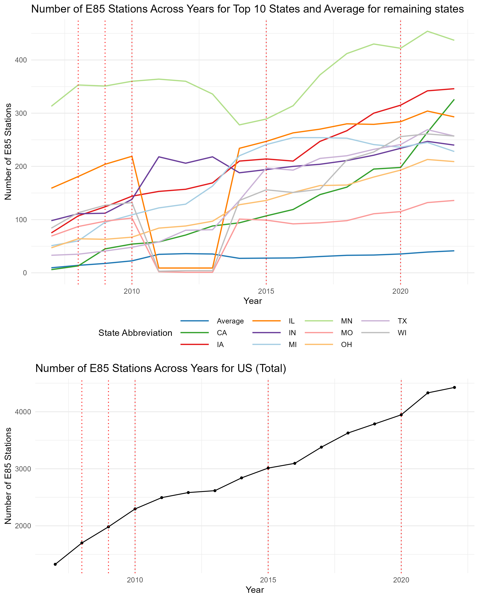
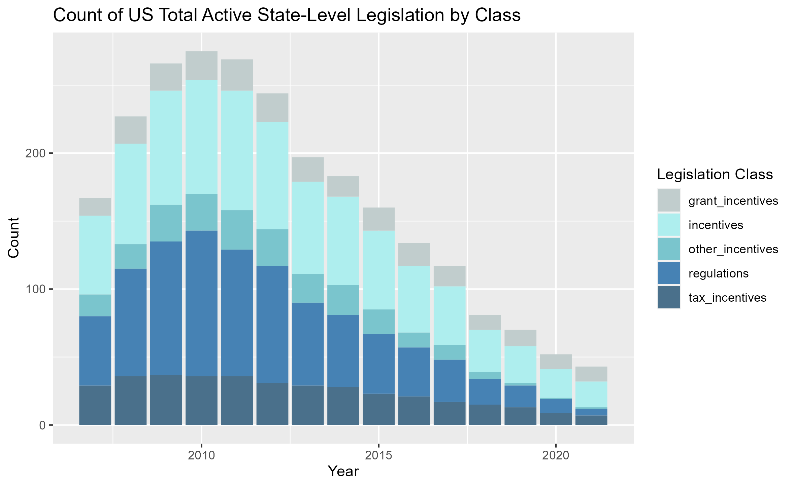
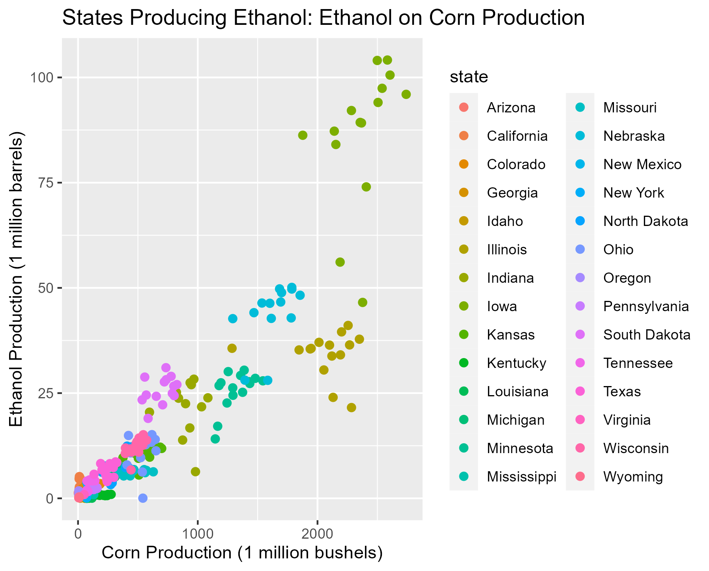
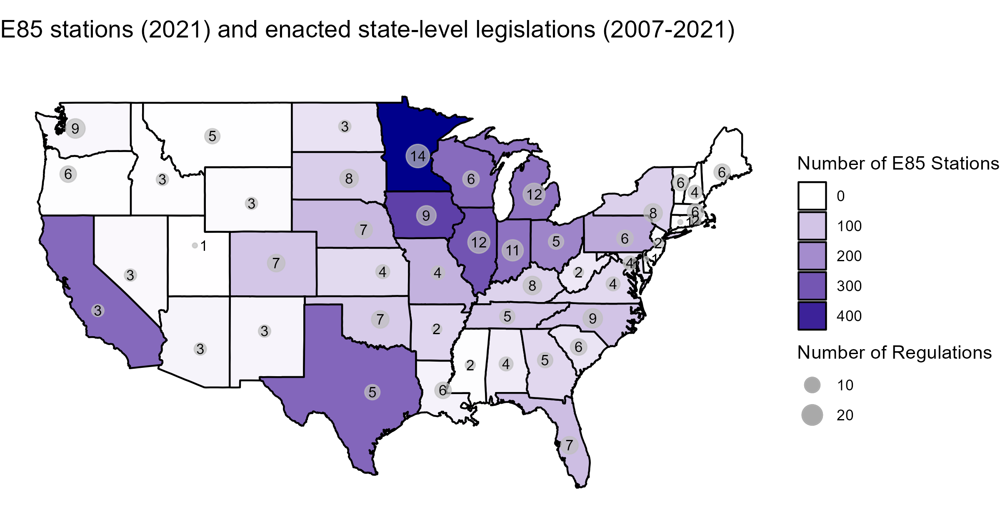
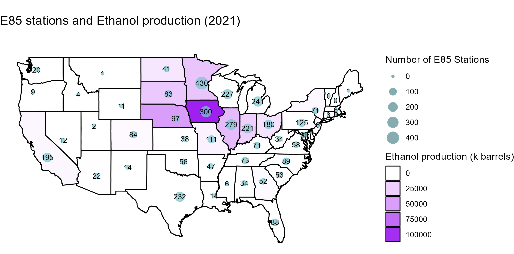
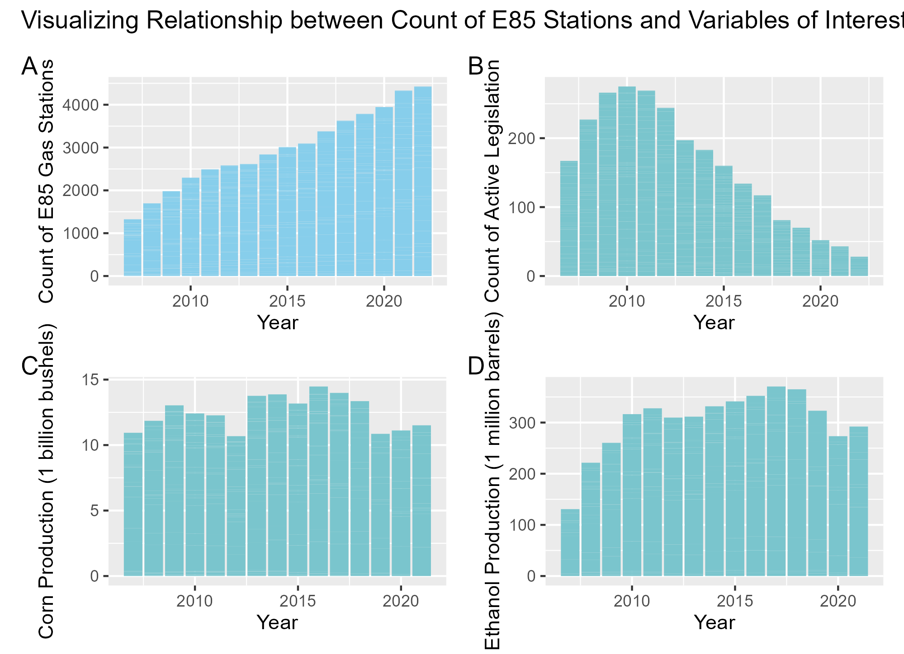

### Topic

What is the relationship between ethanol demand and state-level legislation?

### Motivation

Ethanol is a good source of clean energy. Incorporating it into gasoline allows for cleaner vehicle fuel sources. Moreover, ethanol is produced domestically from domestically grown crops, reducing U.S. dependence on foreign oil and increasing the nation's energy independence. Therefore, derived from domestically cultivated crops, ethanol not only promotes environmental responsibility but also strengthens the US nation's energy independence by reducing dependency on international sources.

Since the 1990s, state and federal governments enacted more than 300 laws incentivizing a market for ethanol. In this study we will specifically focus on state-level legislation. While federal legislation is likely related to changes in ethanol demand across all states, focusing on state-level legislation will allow us to consider how differential policies to promote ethanol production and use are related to differential changes in ethanol demand in individual states.

In order to investigate the relationship, we choose the number of E85 stations available as a proxy for ethanol demand. The term E85 specifically denotes a blend containing 85% ethanol and 15% gasoline or other hydrocarbon, measured by volume. This blend represents the highest ethanol concentration commonly used in vehicles today. Other fuel blends, E10 and E15, can be run in most engine types. These fuel blends, requiring smaller shares of ethanol, are commonly required by legislation whereas E85 is not required. Not all vehicles can use E85 fuel, so consumers purchasing E85 fuel make an active decision to operate a vehicle which can use E85 and then purchase E85 fuel. For these reasons, we assume the number of E85 stations approximates ethanol demand. If legislation increased the number of E85 stations, consumer demand may have been driven by increased availability. Or, conversely, consumers with a high demand for E85 fuel may have lobbied for state-level legislation increasing the number of E85 stations. Therefore, this project aims to investigate the relationship between the number of E85 stations and state-level legislation.

### Research Questions

The project aims to answer the following research questions:

1.  What is the distribution of E85 stations across all states and time? (Descriptive)

2.  How does total and kind of legislation change over time? (Descriptive)

3.  How is ethanol production related to corn production? (Descriptive)

4.  What is the distribution of E85 stations, legislation, and ethanol production across all states? (Descriptive)

5.  How might the number of E85 stations, legislation, ethanol production, and corn production be related across time? (Descriptive)

6.  What type of legislation is associated with greater increases in E85 stations? (Descriptive)

7.  Are state-level laws and ethanol production good predictors of ethanol demand? (Predictive)

Questions one through four will be answered through this Exploratory Analysis while questions 5 and 6 will be focused on in the forthcoming Econometric Analysis.

### Description of Data

For this project we use data from six main sources:

| Data Set Name                     | Variables                                                                          | Time Span | Geographical Coverage | URL                                                                                   |
|---------------|---------------|---------------|---------------|---------------|
| Ethanol Production                | Ethanol production in thousands of barrels per year                                | 1960-2021 | Nation-wide by state  | [Dataset 1](https://www.eia.gov/state/seds/seds-data-complete.php?sid=US##Production) |
| Corn Production Volume            | Corn production in bushels by year                                                 | 1866-2023 | Nation-wide by state  | [Dataset 2](https://quickstats.nass.usda.gov/)                                        |
| Corn Prices                       | Corn price received in USD/bushel by year                                          | 1867-2023 | Nation-wide by state  | [Dataset 3](https://quickstats.nass.usda.gov/)                                        |
| E85 Stations                      | Number of available E85 station counts by state and year                           | 2007-2022 | Nation-wide by state  | [Dataset 4](https://afdc.energy.gov/stations/states)                                  |
| E85 Stations Laws and Regulations | Description of each law and regulation related to E85 fuel across states and years | 1990-2021 | Nation-wide by state  | [Dataset 5](https://afdc.energy.gov/data_download/)                                   |
| State Population | Population of each state | 2001-2022 | Nation-wide by state  | [Dataset 6](https://www.census.gov/data/tables/time-series/demo/popest/2020s-state-total.html)                                   |

The data set on ethanol production is sourced from the US Energy Information Administration, while the data on corn production and corn prices are obtained from the United States Department of Agriculture. The data sets related to E85 are supplied by the US Department of Energy. And the data sets on state populations are obtained from United States Census Bureau. The time-span we will cover is from 2007 to 2022.

The first four data sets in the table above and the population data set are organized such that every row corresponds to a specific state-year combination and include the relevant variables of interest. The legislation data set is structured such that every row corresponds to individual legislation. It is modified so that the final data set contains "state-year" combinations of laws enacted in the specified year as well as active taxes, incentives, and regulations in that year.  All data sets are merged on "state-year" unique combinations. Each row in the final merged file corresponds to "state-year" combination and contains information on ethanol (in thousands of barrels), corn production (in bushels), corn prices in USD per bushel, number of E85 stations, number of enacted legislation,  and number of active taxes, incentives, and regulations.

### Data Processing

**Ethanol Production Data**

The ethanol production was downloaded from the US Energy Information Administration as an Excel Spreadsheet. This data set includes information for many fuel sources in addition to ethanol and contained a row for each fuel type for each state with columns for each year. A codebook provided on the source website was used to determine filtering criteria for selecting only the ethanol production data. Needed variables were selected and data was transformed from a wide to a long format to create a data frame organized in rows by state-year combinations. No transformations were applied. There were no missing values. Some states did not have any ethanol production while other states have very large ethanol production. These large ethanol production values are not considered outliers because the values accurately describe that some states do have very high ethanol. These observations were left in the data set because it will allow us to explore questions like: Do states with high ethanol production have greater amounts of legislation?

**Corn Prices and Corn Production Data**

An AIP request was used to pull both corn prices and corn production from the National Agricultural Statistical Service (NASS). Sometimes NASS will include suppressed information or missing information as an alphabetical code. There was no suppressed information for either data set. Corn prices had missing information which was re-coded as NA. These were states which do not have large volumes of corn production and account for only 18 observations out of the dataset. No values were considered extreme because, similar to the ethanol production data, high levels of corn production or corn prices include valuable information for this study. No transformations were applied.

**E85 Stations Data**

The data set number 4 provides information on the number of E85 stations and total number of alternative fuel stations. The data set is provided in the form of Excel sheet with state and alternative fuel stations number. Each sheet in the file corresponds to a separate year.

To combine data on E85 stations number across states, we used a function that reads each sheet, creates a column "year" and fills it with the value of the name of the sheet. After that, columns of interest (state, year, E85 stations number and total number of alternative fuel stations) are selected and data is vertically combined for all years. The final processed file includes information on the number of E85 stations and total alternative fuel stations for each state across years 2007-2022.

**Ethanol-Related State-Level Legislation Data**

The data set contains information on laws and regulations with each row being separate law or regulations. We need to transform this data set to the form of state-year-number of laws. To do that, we need a start date and end date for each law.

-   For the laws that missed the ending date, the status date was used as the end date. This is a consistent way to deal with missing values at the end date. The status date refers to the status update date, and it is usually updated when laws are expired (archived). Therefore, the status date is used as an approximation for missing end dates.

-   For the laws that miss the start date (approximately 30% of observations), two approaches were used:

    1.  The first approach is to approximate the start date of the law with the earliest of either the significant update date or the amendment date. The rationale is that the modified law/regulation acts like a new law/regulation and therefore, the update date serves as the start date.
    2.  The second approach for the observations that miss the start date, significant update date, and amendment date is to approximate the start date as the end date minus the median number of days all laws in the data set stayed active. Because the number of days law stays active follows distribution similar to normal distribution, we estimate start date using median of the measure on #active days.

-   The data set also includes characteristics of each law: whether it is regulation or incentive and which type of incentive it is. We generated dummy variables to indicate whether a law falls under the category of regulation or incentives in the form of grants, taxes, or other incentives.

-   Next, we expanded the data set in the way that each row represents a separate incentive/regulation and year when it was active, also indicating type of law (with dummies) and whether this year was a year when the law was first enacted and state. If the start date of the law was after June, we count the first active year as the next year as we assume that it takes time for the law to fully come into force.

-   Last, we organized the dataset by state and year, aggregating the dummy variables. These variables indicated whether the specific year marked the law's inception and whether the law fell under categories like regulation, tax incentive, grant incentive, or other incentives. Consequently, the refined data frame on legislation took shape, where each row represented a state-year combination, with the count of enacted laws, regulations, taxes, grants, and other incentives.

{style="display: block; margin: 1em auto" width="600"}

### Finding 1

{style="display: block; margin: 1em auto" width="600"}

These first two graphs show the number of E85 stations between 2007 and 2021 for (1) the top 10 states with the highest number of stations as well as (2) trend in total US E85 gas stations. In the first graph, we include the average for the remaining states which represent a proportionally small share of E85 stations as compared to the top ten states. Dotted vertical lines indicate the enactment of federal-level laws. We see that the overall number of E85 stations grow over time for all states with the absolute leader being Minnesota. It is interesting to note that the number of E85 stations fell down for some states between 2013 and 2015. Within a span between 2007 and 2021, the total count of E85 stations in the country more than doubled. Interestingly, it is apparent that, with the exception of the law implemented in 2020, it is not obvious that federal-level legislation had an impact across states on the number of E85 gas stations. Instead, the subsequent rise in E85 stations was a result of collective growth across all states, underscoring the influence of aggregate expansion rather than the direct effect of federal laws.

{style="display: block; margin: 1em auto" width="600"}

This third graphic is composed of three maps showing the distribution of E85 stations across the US in 2007, 2014 and 2021. The darker shades correspond to a higher number of E85 stations. We see gradual increase in E85 station number across states with the corn belt states having the highest number of E85 along with Texas and California.

### Finding 2

{style="display: block; margin: 1em auto" width="600"}

Through this graph, we can see that at the beginning of our time period of interest, there was a significant increase in active legislation relating to ethanol. Today, most of that legislation has been repealed or is no longer active. This allows us to infer two things. First, ethanol-related legislation in the form of grants or incentives may have allowed for capital investments in ethanol production and distribution which would have effects on the number of E85 stations and ethanol demand. The effects of this legislation may still persist while the actual legislation has expired or been repealed because improvements to capital infrastructure do not necessarily need to be perpetual. Secondly, there may be a reduction in ethanol related legislation because the legislation was repealed due to it no longer being valued or because it was considered ineffective. This would imply that the legislation had no impact on the number of E85 stations and, subsequently, demand.

### Finding 3

{style="display: block; margin: 1em auto" width="600"}

Ethanol production is clearly higher in states which have larger corn production. States with high corn and ethanol production include Iowa, Missouri, and Illinois. This implies that much of the ethanol produced in the United States is produced in states which also produce a lot of corn - likely due to market effects incentivizing minimization of transportation costs. Corn production and ethanol production is not particularly variable across years (each data point represents ethanol and corn production for a state in a given year). One of the things we can infer from this is that capital investments are large enough to require supply of ethanol and corn production to be relatively stable.

### Finding 4

{style="display: block; margin: 1em auto" width="600"}

This first map illustrates the distribution of E85 stations across the US in 2021, with gray dots representing the number of laws enacted between 2007 and 2021 in each state. Larger dots indicate a higher number of legislations, while darker shades signify a greater number of E85 stations. The pattern reveals that states with fewer legislations (ranging from 0 to 2) tend to have fewer E85 stations. However, the relationship becomes less clear in states with higher numbers of incentives and regulations. For instance, both Nevada and California have enacted 3 legislations, yet the number of E85 stations in these states varies significantly.
{style="display: block; margin: 1em auto" width="600"}

This second map illustrates distribution of ethanol production across the US in 2021 with blue dots representing the number of E85 stations available in each state in 2021. Larger dots indicate a higher number of E85 stations, while darker shades signify a greater amount of ethanol produced. We do not see a clear relationship between the number of E85 stations and ethanol produced with high producing states like Iowa and Illinois having significantly different numbers of E85 stations available.

### Finding 5

{style="display: block; margin: 1em auto" width="600"}

Through this graphic, we are able to identify that the total number of E85 gas stations in the United States increased following significant increases in the number of active state-level legislation in the United States. We can see that corn production does not vary significantly (ethanol related legislation is likely not affecting the amount of corn produced), but ethanol production does increase as active ethanol related legislation increases. Ethanol related legislation is associated with increases in ethanol production and E85 demand implying that legislation helped bolster the market for ethanol.
